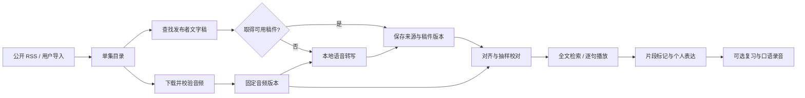

# 本地播客学习库：来源调查与系统设计

版本：0.1｜调查日期：2026-09-06，香港时间｜本文保留最初的产品设计；第一版本地界面现已实现，最新功能和入口以 [使用说明](README.md) 为准。本地自动转写仍未实现。

## 1. 结论：可以建库，但不能假设每期都有官方逐字稿

官方音频、节目简介、逐字稿是三种不同的材料。可取得音频，不代表发布者同时开放了文字稿。Apple Podcasts 是收听入口，长期资料库应以发布者公开的 RSS 和下载到本机的文件为基础。
v
本次直接读取原始 RSS，而非只根据搜索结果判断：

| 来源 | 当前 RSS 记录 | 音频 enclosure | transcript 标签 | chapters 标签 |
|---|---:|---:|---:|---:|
| Waveform | 373 | 373 | 0 | 0 |
| The PetaPixel Photography Podcast | 146 | 146 | 0 | 0 |

这些是当前订阅源的记录数，可能包含预告、特别节目，不等于正片集数，也不保证覆盖全部历史。0 个 transcript 标签只证明本次 RSS 未公开这类链接，不能推出网上任何地方都不存在该节目文字稿。chapters 标签为 0 也不代表简介里没有时间戳。

实测证据保存在 [Waveform 来源检查](资料库/waveform/source_audit.json)、[PetaPixel 来源检查](资料库/petapixel/source_audit.json)。对应目录的 feed_snapshots 保留原始 XML 和哈希，catalog.json 保存可检索的目录、简介和媒体链接。PetaPixel 的 [官方节目页](https://petapixel.com/podcast/) 明确列出了所用 RSS；Waveform 可从 [官方节目页](https://podcasts.voxmedia.com/show/waveform-the-mkbhd-podcast) 和 [官方平台入口](https://linktr.ee/MKBHD) 交叉识别节目。

### 音频：公开 RSS 中的文件是主入口

Waveform 使用 [Megaphone RSS](https://feeds.megaphone.fm/STU4418364045)，PetaPixel 使用 [官方列出的 RSS](https://anchor.fm/s/e3085708/podcast/rss)。读取每条记录的 enclosure，下载发布者分发的 MP3/M4A 即可，不依赖国区播客搜索结果，也不需要把 Apple App 缓存解包。

本机能访问源不代表 iPhone 在另一网络一定能访问。本地下载后离线播放能减少这种不确定性。先同步所有目录，媒体按选中单集下载，不默认把几百期音频全部下载。

### 文字：分来源取得，不混称“官方原文”

1. 优先检查 RSS 的 podcast:transcript，再检查官网明确提供的 transcript/VTT/SRT 链接。记录“发布者提供”；只有来源明确说明人工审核，才标记“人工校对”。
2. 有合法导出途径的官方视频字幕可导入，但官方频道上的自动字幕仍是机器识别结果。视频剪辑和播客音频版本不同，不能直接套用时间戳。
3. 没有可取得的稿件时，对已保存的音频本地转写，标记“本地自动转写，未校对”。用户纠错保存在新修订中。
4. 只有 TXT 的稿件可以先阅读检索，未完成对齐之前不能假装支持逐句跳播。

Apple 官方说明：普通听众可在 App 看稿并复制有限片段；全文稿下载入口位于发布者使用的 Podcasts Connect。这不是面向任何听众的公开批量下载接口，因此本系统不依赖它。[Apple 文本说明](https://podcasters.apple.com/support/5316-transcripts-on-apple-podcasts)

YouTube Data API 的字幕下载要求调用者具有编辑该视频的权限，因此“节目在官方 YouTube 有字幕”不能推出我们可以通过该 API 批量下载。官网直接公开的文件或用户可正常导出的字幕作为可选导入途径，本地转写作为可靠后备。[YouTube 官方接口说明](https://developers.google.com/youtube/v3/docs/captions/download)

第三方转写网站不作为官方稿件来源。本库记录来源、保存日期和访问条件，处理公开下载或用户有权导入的材料，不绕过付费墙，也不自动公开发布保存的整期音频和全文。

## 2. 为你设计的日常体验

你最初想要的是早晨轻松听 30 分钟。现在加入复盘，也不应让每一期都变成两小时作业。系统的默认路径是“继续听”，深入学习由你选择。

### 早晨模式：30 分钟只听也能正常使用

打开首页，只有一个主要按钮：**继续上次那一期**。默认隐藏文字稿，记住播放位置和倍速。可以设置 30 分钟停止，也可以继续播放。广告可手动跳过，但保留原文件和完整时间轴。

听到不懂或喜欢的地方，按一次“标记这里”：记录当前时间及之前约 15 秒的上下文。继续听，不弹出填词、翻译和测验。界面允许将标记标为“没听清”“想学这个说法”“这个话题有意思”，分类也可以以后补。

听到 30 分钟只记录播放位置和实际播放区间，不自动判定“听懂了”。退出、睡眠或浏览器被关闭后仍能恢复；进度写入本地数据库，浏览器存储只做缓存。

### 复盘模式：选一段，5—15 分钟即可

| 步骤 | 操作 | 要解决的问题 |
|---|---|---|
| 1. 不看稿重听 | 从一个标记中选 20—90 秒，只听一遍 | 是声音没识别，还是内容本身不懂？ |
| 2. 揭示英文 | 显示原文；点一句听一句；必要时 0.85—1.0 倍速 | 把听到的声音和词句对应起来 |
| 3. 按需解释 | 只解释选中句的表达、指代和语境，中文默认折叠 | 理解这句话为什么这样说 |
| 4. 选一个表达 | 保存完整短语和原句上下文，不机械摘孤立生词 | 下次能在自己的话里使用 |
| 5. 可选开口 | 先模仿一句，再用自己的例子说一句；可录 30—60 秒 | 从“认识表达”过渡到“会用表达” |
| 6. 一键收尾 | 标记“仍不清楚 / 听懂了 / 自己能用了” | 留下真实学习证据 |

每天只泛听也完全有效，不会出现必做任务欠账。完整一期是资料容器；具体复习单位是你选中的片段。每期都有反复学习的入口，但无需每期都精读完。

### 之后怎么复习

起步用简单可解释的节奏：选中片段在 1、3、7、14 天后进入可选复习队列。这是产品初始设置，不宣称是适合所有人的最佳间隔。每次最多显示 3 个片段，总计约 5 分钟。选“仍不清楚”回到较短间隔；选“能自己用”拉长间隔。逾期任务顺延，可以暂停，不惩罚断更。

复习先播放音频、隐藏答案，再揭示英文；口语卡先给中文场景提示，让你自己说，最后对照原句。卡片必须带原音频区间和上下文。只看过答案不记成掌握。

每两周可自愿用同一主题录一分钟，对比是否更容易完整表达、是否用上旧表达。不用自动口音评分或“流利度 95 分”制造虚假的精确感。

## 3. 界面包含什么

### 首页：继续听

显示当前节目、上次位置、剩余时间、继续播放按钮，以及小入口“我的标记”“复习 3 个片段”。不用把满屏未听节目当作待办。

### 节目资料库

节目按数码、主机游戏、摄影、AI、杂谈分类。单集可搜索标题、简介和已导入逐字稿，可按“已下载”“有文字”“待校对”“我标记过”筛选。目录未下载的单集也能看信息。

### 单集学习页

播放器始终可见；右侧在“英文稿 / 简介与来源 / 我的笔记”之间切换。手机布局上下排列。支持 A—B 循环、前后 10 秒、句子跳播、键盘快捷键、自动滚动开关；只在时间轴已对齐时开放逐句跳播。时间戳旁显示稿件来源和“自动转写 / 已校对片段”的状态。

句子可点击并保存为卡片。英文稿可以全部隐藏，中文释义只展开选中部分。全文搜索结果点击后进入原句上下文，不能只显示一条脱离语境的译文。

### 我的表达与录音

按“表达观点、赞同与反驳、比较产品、讲述经历、澄清意思”组织短语，更贴近日常口语；同时保留游戏、摄影等主题标签。每张卡保存原音频、你的新例句、练习录音和复习历史。AI 提供的新例句必须标注为生成例句，不能伪装成主持人说的话。

### 来源与任务页

单独显示目录同步、下载、转写、对齐、索引任务。失败写明“网络不可达 / 文件校验失败 / 未发现官方稿 / 缺少本地转写组件”等可操作原因。技术状态不占日常学习首页。

## 4. 数据怎么保存才不会越用越乱

```text
03_知识库/播客学习/
  README.md                         本次交付与使用入口
  系统设计.md                       本文
  单集复盘模板.md                   独立于软件也能用
  资料库/
    waveform/
      catalog.json                  节目目录和简介
      source_audit.json             本次来源检查
      feed_snapshots/<sha256>.xml   原始订阅源快照
      episodes/<episode_id>/
        episode.json               单集元信息
        asset.json                 下载来源、哈希和验证状态
        audio_<hash>.mp3            保存的音频版本
        show_notes.txt             简介，不能当逐字稿
        transcripts/<revision>/    后续：TXT、VTT、分段JSON及来源
        notes.md                   后续：个人复盘
        recordings/                后续：自己的练习录音
99_系统文件/
  工具/podcast_archive.py           本次已实现：目录同步、单集下载、校验
  工具/podcast_fetch.ps1            Windows 网络兼容层
  索引/播客学习/schema.sql          完整应用的数据结构草案
  缓存/临时文件/podcast_network/    下载暂存，不是最终资料
```

播客资料不混入现有 AI 课程课号，也不参与“每 10 篇 AI 课程总结”的计数。未来入口可接入现有开始学习页的独立“播客”区域。

所有笔记、逐字稿都可导出 TXT/Markdown；时间轴导出 VTT/JSON；卡片导出 CSV/JSON；音频保留通用格式。SQLite 管索引、状态和练习历史，媒体保存在文件夹，数据库不塞大音频。完整备份要同时包含数据库、稿件、媒体与个人录音，恢复时校验哈希；云同步默认关闭。

### 最重要的技术决定：稿件绑定具体音频版本

Megaphone 会按请求动态组合广告，不同下载可能含有不同广告。同一集 GUID 和标题相同，音频长度仍可能变化。[Megaphone 技术说明](https://support.megaphone.fm/en/articles/1572337-megaphone-features)

因此必须保存下载文件 SHA-256；字幕、书签和循环片段引用 asset_id/哈希，而不只引用节目名。原文件不因“刷新最新”被覆盖。换音频版本后，字幕需要重新对齐，旧笔记仍指向旧版本。YouTube 字幕不与 RSS 音频直接混用，简介时间戳也必须经试听核对。

episode_id 优先基于节目内 GUID 建立稳定标识，标题更新不产生新集。没有 GUID 时用媒体/单集 URL 作为后备并标记身份可信度较低；RSS 不再包含的旧集仍留在本地。

## 5. 实现选择与处理流水线

建议第一版采用 **Python 本地服务 + SQLite/FTS5 + 简单浏览器界面**。先把归档与学习状态做扎实，再决定是否封装桌面安装包。桌面服务仅监听 127.0.0.1；不需要账号，不依赖云端数据库。前端和字体本地保存，离线仍能播放已下载媒体、查稿和做笔记。



### 本地转写

本机实测：i5-14600KF，约 24 GB 内存，RTX 5070，驱动报告约 12 GB 显存。适合优先尝试本地转写，但本次没有安装或跑通转写模型，不能把显卡规格当作兼容性或速度验证。

候选为 faster-whisper。其维护者文档支持 CPU/GPU 转写和量化，并列出 CUDA/cuDNN 等运行依赖。优先做 5—10 分钟样本，验证显卡兼容、多人插话、品牌型号、时间戳和内存占用，再锁定模型与运行库版本；GPU 不兼容时可先验证 CPU 路径。首次下载模型需要网络和磁盘空间，下载后转写可在本机完成。[项目文档](https://github.com/SYSTRAN/faster-whisper)

MVP 先做分句时间轴，不追求逐词精准跟随或自动认出每个主持人。低质量片段标为待核对；无法确定的说话者使用 Speaker 1/2，不猜名字。英文原始识别文本与人工改稿分开保存。品牌名词表只用于纠错提示，不能强行把识别结果改成节目简介里的名词。

### 质量门槛

全文“可检索”和“可用来练发音”是两种就绪状态。完整转写可先标为未校对供搜索，但加入口语卡的原句需要结合原音频确认。转写的词概率不是可靠的正确率，也不作为口语成绩。

转写完成后人工式抽检开头、中间、结尾、广告前后和多人插话片段。检测空稿、重复句、时间戳越界、异常长空白；有问题保留警告，不靠语言模型补出没听见的内容。对齐不合格的段落允许读稿，不开放精确跳播。

### 解释与总结

第一版可手动写笔记，核心播放、检索和复习不依赖 LLM。后续自动解释只接收选中片段及少量上下文，生成释义、口语功能和可选例句；所有引用必须对应 segment_id。整集摘要需要取得整集文字后才生成；只有简介时必须标注“根据简介整理”。

中文翻译与解释独立存储、可删除重做，不覆盖英文稿。涉及 AI 圈新闻、规格或发布传闻时区分“主持人当时的说法”和“已核实事实”，必要时链接来源。默认不调用付费 API 或上传整期音频；未来若选择云服务，作为单独可选配置。

### 后台与手机

任务状态为 queued/running/succeeded/failed/cancelled，进程中断可重新执行。下载必须写暂存文件后校验提交；动态广告媒体不能盲目将新请求字节续写到旧 .part。生成任务以音频哈希、模型和参数组成去重键。下载/转写失败不能阻止播放已有内容。

本次仅提供手动触发工具，没有创建定时任务。完整应用可以在打开时检查更新，默认只更新目录；用户选中才下载。避免形成每天自动转写数小时但实际没人复习的积压。

你用 iPhone 听播客，因此完整产品要预留手机播放路径，但不能假设 Apple Podcasts 会把播放进度同步给本地系统：未找到适合本项目的公开同步接口。第一版可手填“从 32:10 继续”。后续手机浏览器访问同一局域网的本机服务，需要单独开启访问令牌和防火墙规则；电脑关闭则不可访问。麦克风录音还需要安全上下文，因此手机录音可先用系统录音后导入，不能承诺 HTTP 局域网页面直接录音。日常 Windows localhost 录音需用户授予麦克风权限。

## 6. 开发顺序与验收

| 阶段 | 交付 | 验收标准 |
|---|---|---|
| 本次：调查与归档验证 | 两档 RSS 实测、目录与快照、单集下载工具、设计与模板 | 不依赖 Apple 搜索取得目录；有可复现证据；下载成功与失败如实标记 |
| 第 1 阶段：本地听播库 | 目录、按需下载、播放器、续播、标记、笔记、备份 | 断网能听；关闭重开保留位置；重复同步不重建同一集 |
| 第 2 阶段：文字与时间轴 | 稿件导入、本地转写、修订、逐句播放、搜索 | 完整一期跑通；抽样跳播与原声一致；换音频触发重新对齐 |
| 第 3 阶段：学习闭环 | A—B 循环、表达卡、复习队列、录音与导出 | 卡片回到原声；自评有记录；无反馈不判定掌握；恢复备份可继续学 |
| 第 4 阶段：手机与可选解释 | 手机访问、跨设备状态、可选语言模型 | 安全访问与录音路径实测；无模型也能使用核心功能 |

### 先用一期做完整验收

以 Waveform 一期为样本：导入 → 下载 → 本地播放 → 取得或生成全文 → 抽查时间轴 → 标记 3 段 → 保存 2 个表达 → 录一分钟复述 → 次日复习 → 导出并恢复。经过这条路径再扩到游戏、摄影和其他节目。

不承诺“完美复盘”或所有来源永远能取。产品要做到每个材料的来源可追溯、每个练习可回到原声、失败有后备路径、已有学习记录不会因换平台而丢失。

## 7. 容量与维护预算

按 128 kbps 估算，一小时音频约 57.6 MB；100 期、每期 90 分钟约 8.64 GB，373 期约 32.2 GB。这里只是明确码率和时长假设的估算，实际文件看下载记录；模型、录音和备份另算。

目录与文字优先全量保存，媒体按需保存；缓存可清理，但删媒体之前显示哪些卡片引用它。当前工具不会自动删音频。备份恢复时原始媒体和 hash 一致才能确保旧卡片继续跳到正确位置。同盘副本不能防磁盘损坏，异地备份位置由你后续选择。

## 8. 本次尚未验证的边界

尚未获取两档节目的官方完整逐字稿；未完成 ASR 实测、语音准确率评估、全媒体解码、播放器界面、手机连接、长期定时执行或备份恢复。已实现部分以 [使用说明](README.md) 和每期 asset.json 的实际状态为准，不能把设计中列出的功能当成已经上线。
