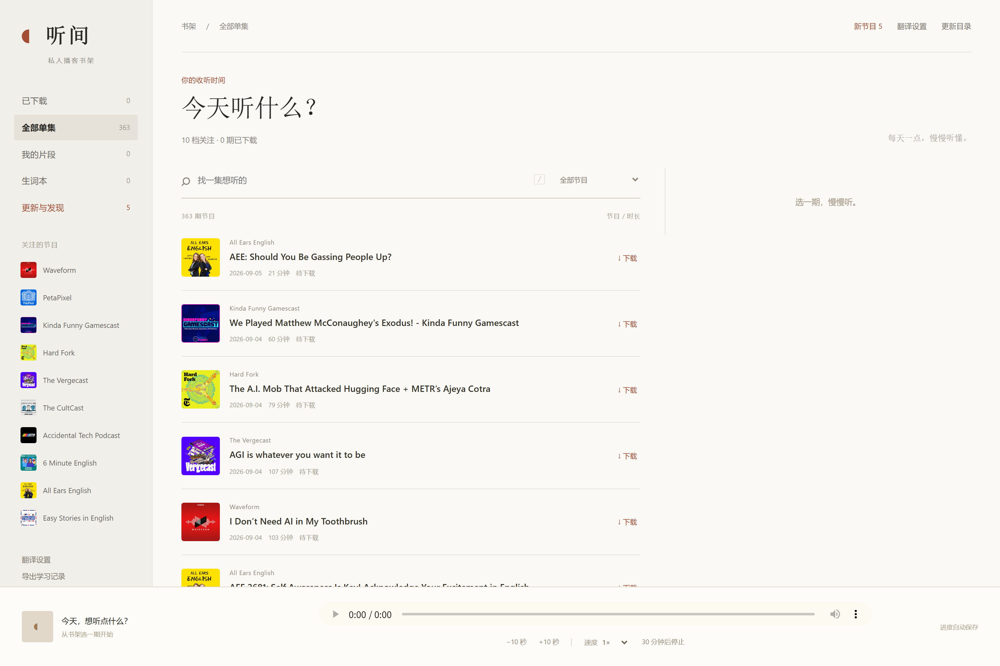
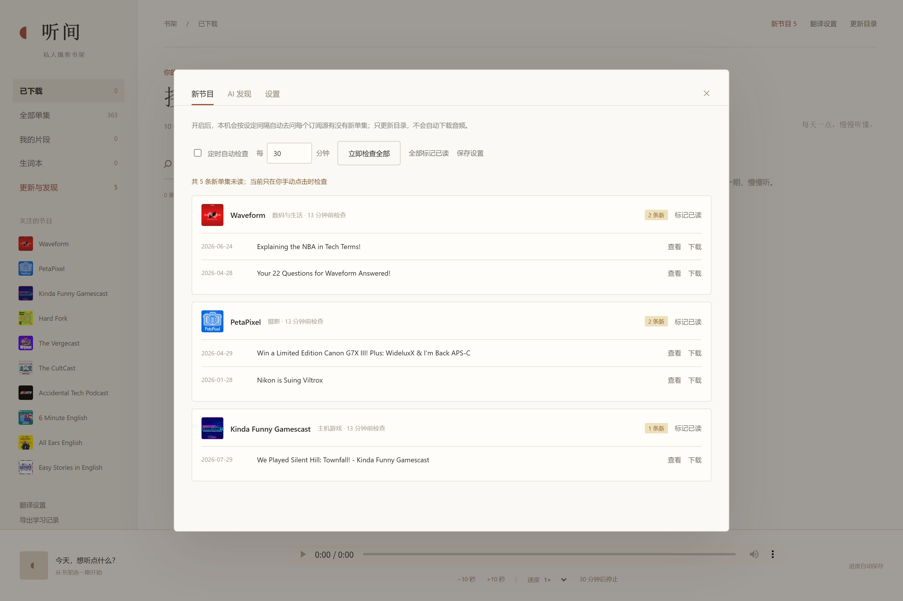
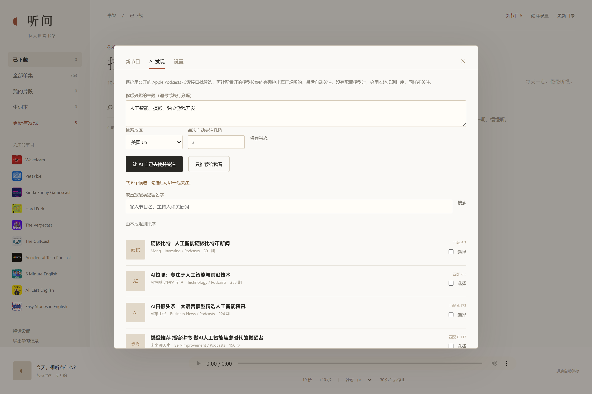

# 听间 · 本地播客书架

> 把英文播客变成可以慢慢啃的本地资料：自己更新订阅、自己去找想听的新节目、下载、逐句听、划词收藏、中英对照。

一个**跑在自己电脑上**的播客学习工具。所有音频、字幕、笔记、生词都存在本地，只有英文文本在你授权后才离开这台机器。只依赖 Python 标准库，克隆下来就能跑。

<p>
  
  
  
  
  
</p>

---

## 这是什么

「听间」是一个本地优先（local-first）的播客学习台。它不去抢播客客户端的活，而是解决一个具体问题：**英文播客听过就忘，想精听又没有得力的工具。**

整套东西是单进程的本地 Web 应用：Python 起一个只监听 `127.0.0.1` 的服务，浏览器打开就是书架。没有云、没有账号、没有数据库服务。

### 它做了什么

| 能力 | 说明 |
|---|---|
| **订阅自动更新** | 后台按你设的间隔自动去问每个订阅源有没有新单集，有新节目在侧栏亮出来。默认关闭，打开后无需守着「更新目录」按钮。 |
| **AI 自主发现** | 写下你感兴趣的主题，系统用公开检索接口找候选，再让你配置的模型挑出真正想听的，然后自动关注、拉目录、存封面。没有密钥也能用本地规则排序。 |
| **目录与下载** | 解析 RSS 建目录、按需下载单集，全部带 SHA-256 校验与来源回执，不静默替换已归档的文件。 |
| **专注收听** | 书架 / 单集阅读页两态切换，底部常驻播放器，支持 ±10 秒、倍速、30 分钟定时停止、进度自动续播。 |
| **片段与笔记** | 随手标记一段音频区间，写一句备注，之后跳回原声或循环播放。 |
| **本地转写 + 中英字幕** | 可选接入 faster-whisper 在本机识别英文，再把英文字幕翻译成中文，逐句对照、可切换语言、可导出 TXT / SRT。 |
| **划词收藏** | 字幕上选中一个词或短语，自动保存中英原句快照并补齐词义，形成可搜索的生词本。 |

### 一次典型使用

```text
1. python run.py                       # 起服务，浏览器打开
2. 「更新与发现 → AI 发现」写下主题 → 让 AI 自己去找并关注
3. 打开「定时自动检查」，之后每天有新单集自动出现在「新节目」
4. 挑一期下载 → 生成中英字幕 → 边听边划词 → 导出笔记
```

### 界面

书架与单集列表，左侧「更新与发现」上的数字就是自动巡检发现的新单集数量：



订阅自动更新：每个订阅源上次什么时候检查、有没有新单集、检查失败的原因，都在这里：



AI 自主发现：写下主题，用公开检索接口找候选；配了模型就由模型挑，没配就用本地规则排序（下图为本地规则排序的结果）：



---

## 快速开始

**唯一要求：Python 3.10 或更新版本。** 核心应用不依赖任何第三方包。

```bash
git clone https://github.com/pomorlyk/local_podcast_system.git
cd local_podcast_system
python run.py
```

浏览器会自动打开 <http://127.0.0.1:8765>。也可以：

```bash
python run.py --port 9000      # 换端口
python run.py --no-browser     # 不自动开浏览器
```

各平台的一键脚本：

| 平台 | 命令 |
|---|---|
| Windows | `powershell -ExecutionPolicy Bypass -File start.ps1` |
| macOS / Linux | `./start.sh` |
| 任意 | `python run.py` |

服务只监听 `127.0.0.1`，并且校验 `Host`、`Origin` 和每页一次的随机 token，所以局域网里别的机器打不开它，网页里的脚本也调不动它。

---

## 仓库结构

```text
local_podcast_system/
├── app/                        后端（Python 标准库）
│   ├── podcast_server.py       HTTP 服务、路由、任务队列
│   ├── podcast_archive.py      RSS 解析 / 目录合并 / 下载校验
│   ├── podcast_feeds.py        ★ 订阅自动更新：定时巡检 + 新单集比对
│   ├── podcast_discover.py     ★ AI 发现：检索、排序、自动关注
│   ├── podcast_llm.py          ★ 自带密钥的模型客户端（不内置任何密钥）
│   ├── podcast_transcribe.py   本地 Whisper 转写（可选）
│   ├── podcast_translate.py    中文字幕翻译（可选）
│   ├── podcast_vocabulary.py   划词收藏与词义补齐
│   └── paths.py                所有路径的唯一出处
├── web/                        前端（原生 JS，无构建步骤）
│   ├── index.html  app.js  style.css  vocabulary.js    原有界面
│   └── extras.js   extras.css                          ★ 新功能的加法式界面
├── data/
│   ├── index/                  shows.json、schema.sql、示例配置
│   └── library/<节目>/         每个节目一份目录 + 封面 + 来源审计
├── docs/                       架构说明与使用文档
├── tests/                      55 个测试，全部离线
├── tools/                      可选的模型下载脚本
└── run.py  start.ps1  start.sh
```

★ = 这个仓库相对原始版本新增的部分。

---

## 新增功能怎么用

两处新功能都是**只做加法**：原有的界面布局、交互和代码路径没有被改写，新东西全部在 `web/extras.js` / `web/extras.css` 里自建 DOM，侧栏多一个「更新与发现」入口。

> 关于原有前端：`web/app.js`、`web/style.css`、`web/vocabulary.js` 的代码一行未动；`web/index.html` 只新增了一行 `<script src="/extras.js" defer>`。整个仓库统一了换行符（CRLF → LF，见 `.gitattributes`），这是唯一的全局差异。

### 一、订阅自动更新

原来只有手动点「更新目录」。现在 `app/podcast_feeds.py` 会：

- 按设定间隔（5 分钟 – 24 小时，默认 30 分钟）轮询每个订阅源；
- 把这次拿到的单集 ID 和上次已知的 ID 求差集，**只报新增**；第一次巡检会把现有目录作为基线，不会把几千期历史全报成「新」；
- 记下每个源的上次巡检时间与失败原因，一个源挂了不影响其它源；
- 结果落在 `data/index/feed-state.json`，界面显示未读条数。

点开侧栏「更新与发现 → 新节目」可以看到具体是哪几期，直接「查看」跳到学习面板或「下载」排队。读过的会保留记录并标记已读，重新同步也不会再冒出来。

### 二、AI 自主发现

三步流水线，全部在 `app/podcast_discover.py`：

1. **检索** —— 用 Apple Podcasts 公开检索接口（免费、无需密钥）按你写下的主题搜候选；
2. **排序** —— 配置了模型就让模型读候选列表、挑出真正匹配的并给一句理由；没配置就用一套透明的本地规则（节目名命中 > 类型命中，排除词降权，兼顾活跃度）；
3. **关注** —— 选中的节目写进订阅登记表、同步 RSS 目录、落盘封面，走的是和手动「更新目录」完全相同的代码路径。

界面上有「让 AI 自己去找并关注」（一键到底）和「只推荐给我看」（先看再勾）两个入口，另外还有直接按名字搜索并关注的入口。取消关注会把整个节目文件夹**移动**到 `data/archive/`，不删除——音频、字幕、笔记都还在，想恢复就移回 `data/library/`。

---

## 隐私与密钥

这个仓库**不包含任何密钥**，也不包含你的任何音频或学习记录。

| 数据 | 位置 | 是否提交 |
|---|---|---|
| 音频、字幕、转写结果 | `data/library/*/episodes/` | 否（已 gitignore） |
| 学习记录（笔记/生词/播放位置） | `data/ui.sqlite3` | 否 |
| DeepSeek 翻译密钥 | `data/index/translation-settings.json` | 否 |
| 模型密钥（AI 发现） | `data/index/discovery-settings.json` | 否 |
| 你的兴趣清单 | `data/index/interests.json` | 否（有 `interests.example.json`） |
| 节目目录元数据 | `data/library/*/catalog.json` | 是，可重新生成 |

密钥有两种放法，都不落进仓库：

1. **界面里填** —— 在「更新与发现 → 设置」或「翻译设置」里粘贴，Windows 下用当前账户的 DPAPI 加密后存在本地文件；
2. **环境变量** —— 完全不写文件：

   ```bash
   set PODCAST_LLM_API_KEY=你的密钥
   set PODCAST_LLM_BASE_URL=https://api.deepseek.com   # 可选
   set PODCAST_LLM_MODEL=deepseek-chat                 # 可选
   ```

模型只用来做两件事：把英文字幕翻译成中文，和在候选列表里挑节目。**音频永远留在本机**，只有文本会发出去。翻译和排序都有失败重试与降级：没有密钥时翻译任务停在「等待密钥」，发现功能退回本地规则，其它一切照常。

---

## 可选组件

核心应用零依赖。下面两块按需开启，不装也不影响其它功能。

### 本地语音转写（需要 NVIDIA GPU）

```bash
python -m venv .venv-asr
.venv-asr\Scripts\pip install -r requirements-asr.txt     # Windows
powershell -File tools/download_podcast_model.ps1          # 下载并校验模型
set PODCAST_ASR_PYTHON=.venv-asr\Scripts\python.exe
set PODCAST_ASR_MODEL=models\whisper-large-v3-turbo
```

模型约 1.6 GB，脚本会按 Hugging Face 元数据核对 SHA-256。转写过程不联网、不上传音频，完成后进程退出并释放显存。

### 模型密钥

翻译与 AI 发现共用一套「自带密钥」的配置，支持 DeepSeek 和任意 OpenAI 兼容接口。详见上文「隐私与密钥」。

---

## 测试

```bash
python -m unittest discover -s tests -t tests -v
```

55 个测试，全部离线运行，不需要网络、GPU 或密钥。覆盖 RSS 解析与目录合并的幂等性、下载校验与回执、媒体 Range 请求、字幕导入与版本、翻译的批次校验与失败降级、生词本快照、以及本次新增的**新单集比对、巡检容错、检索归一化、排序权重、自动关注、取消关注归档、密钥不落盘**。

---

## 设计与边界

- **本地优先，但不是加密工具。** 服务只监听回环地址并校验来源，够挡住局域网和跨站脚本；它保护的是「不被顺手翻到」，不是「对抗能读到这台机器磁盘的人」。
- **不改写已归档的文件。** 音频一旦落盘就带哈希和回执，内容变了会被明确报出来而不是被静默覆盖——播客里的动态广告会让「同一期」的字节在不同时间不一样。
- **增量、可恢复。** 转写和翻译都按批落库，中断后重试只补缺失部分，不重跑已完成的工作。
- **不自动下载历史。** 更新目录只动元数据，音频永远要你点一下。

已知限制：转写需要 NVIDIA GPU；自动识别不区分说话人，人名、游戏术语和重叠讲话容易错，重要表达要回听原声；订阅巡检是轮询而不是推送，间隔最小 5 分钟；不同地区的 Apple 检索结果可用性不同。

---

## 数据来源与致谢

- **节目目录** 来自各播客公开的 RSS 源，`data/library/<节目>/source_audit.json` 保留每次抓取的 HTTP 回执与来源哈希。
- **中文翻译 / 词义** 由你自选的模型完成，默认 DeepSeek。
- **本地转写** 基于 [faster-whisper](https://github.com/SYSTRAN/faster-whisper) 的 `large-v3-turbo`。
- 仓库里附带的示例目录只保留各节目最近 40 期作为初始数据，完整目录请在前端点「更新目录」重新同步。

## 许可

[MIT](LICENSE)。

---

<details>
<summary><b>English summary</b></summary>

**Tingjian — a local-first podcast study desk.**

A single-process local web app (Python standard library only) that turns English
podcasts into material you can actually study: keep subscriptions fresh
automatically, let a model find and follow new shows that match your interests,
archive episodes with hash verification, play them with resume, transcribe
locally with Whisper, translate to Chinese line by line, and capture vocabulary
by selecting text in the subtitles.

Everything runs against `127.0.0.1` with Host/Origin/token checks. Audio never
leaves your machine; only text does, and only when you configure your own API
key. No key, audio, or study record is included in this repository.

```bash
python run.py
```

- 55 offline tests: `python -m unittest discover -s tests -t tests`
- Two additions over the original build: a background subscription refresher
  (`app/podcast_feeds.py`) and AI-driven discovery (`app/podcast_discover.py`),
  both surfaced through an additive UI layer (`web/extras.js`).
- License: MIT.

</details>
